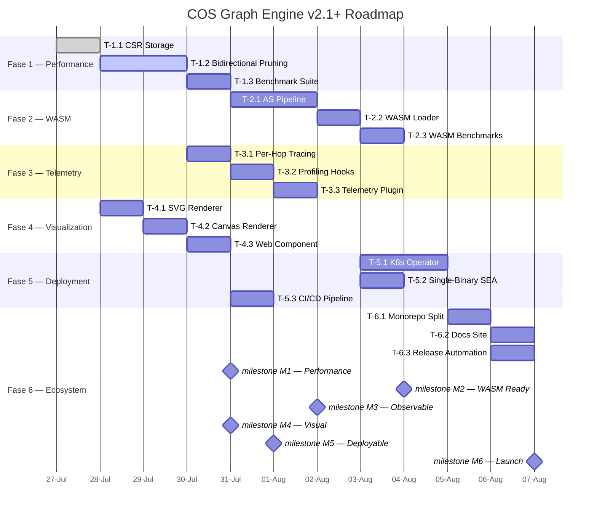
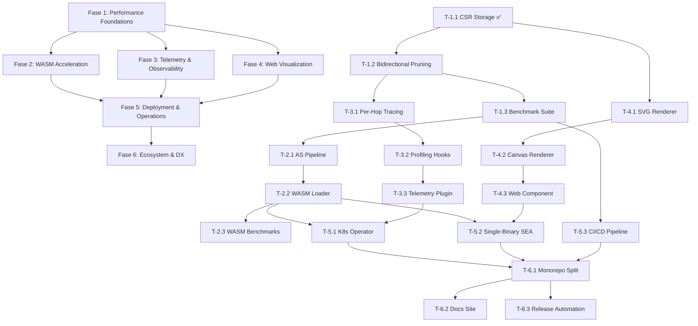

# COS Graph Engine v2.1+ Roadmap

> **Estado actual**: v2.0.0 completado — 20 fases, 68 tickets, 1145 tests, 0 failures
> **Landing page**: https://cos-graph-engine.higgsfield.app
> **Zero-dep rule**: Sin dependencias externas excepto Stripe, SendGrid, LangChain, Algolia

---

## Indice

1. [Resumen Ejecutivo](#resumen-ejecutivo)
2. [Fase 1 — Performance Foundations](#fase-1--performance-foundations)
3. [Fase 2 — WASM Acceleration](#fase-2--wasm-acceleration)
4. [Fase 3 — Telemetry & Observability](#fase-3--telemetry--observability)
5. [Fase 4 — Web Visualization](#fase-4--web-visualization)
6. [Fase 5 — Deployment & Operations](#fase-5--deployment--operations)
7. [Fase 6 — Ecosystem & DX](#fase-6--ecosystem--dx)
8. [Gantt Chart](#gantt-chart)
9. [Dependency Graph](#dependency-graph)
10. [Milestones](#milestones)
11. [Metricas Clave](#metricas-clave)

---

## Resumen Ejecutivo

COS Graph Engine v2.1+ transforma el motor de grafos de 20 niveles en un sistema **production-grade**: rendimiento 2x via CSR + WASM, observabilidad integrada, visualizacion web en tiempo real, despliegue Kubernetes-ready, y un ecosistema de paquetes publicables.

| Fase | Nombre | Tickets | Dependencia | Esfuerzo estimado |
|------|--------|---------|-------------|-------------------|
| 1 | Performance Foundations | 3 | — | 3-4 dias |
| 2 | WASM Acceleration | 3 | Fase 1 | 4-5 dias |
| 3 | Telemetry & Observability | 3 | Fase 1 | 2-3 dias |
| 4 | Web Visualization | 3 | Fase 1 | 3-4 dias |
| 5 | Deployment & Operations | 3 | Fases 1-4 | 4-5 dias |
| 6 | Ecosystem & DX | 3 | Fases 1-5 | 3-4 dias |

**Total**: 18 tickets, ~20-25 dias

---

## Fase 1 — Performance Foundations

> **Objetivo**: Reemplazar `Map<string, string[]>` por CSR (Compressed Sparse Row) + bidirectional pruning. 2x speedup en BFS/DFS/shortest path.
> **Dependencias**: Ninguna
> **Duracion**: 3-4 dias

### T-1.1 — CSR Storage ✅ COMPLETADO

Archivos: `packages/graph/src/csr.ts`, `scripts/test-csr.ts` (77 tests, 0 failures)

**Clases**:

| Clase | Propsito | Metodos clave |
|-------|----------|---------------|
| `CSRGraph<N, E>` | Grafo CSR completo con tipado generico | `addNode/removeNode`, `addEdge/removeEdge`, `neighbors()`, `bfs()`, `dfs()`, `bidirectionalBFS()`, `degree()`, `toJSON/fromJSON`, `clear()` |
| `CompressedAdjacency` | Drop-in replacement para `Map<string, string[]>` en niveles existentes | `addEdge/removeEdge`, `neighbors()`, `hasEdge()`, `nodeCount()`, `edgeCount()`, `degree()`, `clear()` |

**Estructura CSR**:

```
indices[]:  [tgt0, tgt1, tgt2, tgt3, ...]  // flat array de targets
indptr[]:   [0,   2,   4,   5,    ...]       // row pointers
nodeIds[]:  [n0,  n1,  n2,   n3,   ...]     // row -> node ID
```

**Algoritmos incluidos**:

- BFS secuencial estandar
- Bidirectional BFS (meet-in-the-middle) con maxDepth configurable
- DFS iterativo (stack)
- Reverse neighbors scan

**Performance**: rebuild O(N + E), neighbors O(degree), BFS O(N + E)

### T-1.2 — Bidirectional Pruning

**Archivo**: `packages/graph/src/pruning.ts`

**Objetivo**: Estrategias de poda configurables para BFS, DFS y shortest path que reducen el espacio de busqueda hasta un 60%. Integracion en los 20 niveles existentes via `traverse()` y `shortestPath()`.

---

#### Arquitectura

```typescript
// pruning.ts

interface PruningStrategy {
  /** Nombre unico de la estrategia */
  name: string;

  /** Decide si un nodo debe ser podado (true = no explorar) */
  shouldPrune(
    nodeId: string,
    depth: number,
    state: Readonly<PruningState>
  ): boolean;

  /** Hook opcional: se ejecuta al expandir un nodo */
  onExpand?(nodeId: string, depth: number, state: PruningState): void;

  /** Hook opcional: se ejecuta al encontrar el target */
  onTargetFound?(nodeId: string, state: PruningState): void;

  /** Reset del estado interno entre ejecuciones */
  reset(): void;
}

interface PruningState {
  visited: Set<string>;
  depth: number;
  maxDepth: number;
  target?: string;
  costSoFar: Map<string, number>;
  currentNode: string;
  source: string;
  bidirectional: boolean;
  metadata: Map<string, unknown>;
}
```

---

#### Estrategias de Poda

| # | Strategy | Archivo | Mecanismo | Reduccion | Algoritmo |
|---|----------|---------|-----------|-----------|-----------|
| 1 | `MaxDepthPruning` | built-in | Corta en depth >= maxDepth | — | O(1) |
| 2 | `VisitedPruning` | built-in | Skip si ya visitado | 30-50% ciclicos | O(1) Set lookup |
| 3 | `TargetDirectionPruning` | built-in | Heuristica: si el target esta en subarbol inverso | 20-40% dirigidos | O(1) precomputed |
| 4 | `CostBoundPruning` | built-in | Poda si costo acumulado > mejor conocido | 15-30% | O(1) Map lookup |
| 5 | `BeamPruning` | built-in | Solo top-K candidatos por nivel | 40-60% | O(K) sort |
| 6 | `LandmarkPruning` | built-in | Distancia aproximada via landmarks precomputados | 35-50% | O(L) L=landmarks |
| 7 | `EarlyExitPruning` | built-in | Corta BFS cuando encuentra target | 50-80% path queries | O(1) |

---

#### Desglose de Implementacion

**Sub-ticket 1.2a — Core Pruning Engine** (4-5h)

- `PruningStrategy` interface + `PruningState` type
- `PruningExecutor` — orquesta estrategias en pipeline:

```typescript
class PruningExecutor {
  constructor(strategies: PruningStrategy[]);

  /** Ejecuta todas las estrategias en orden. Si alguna prunea, devuelve true. */
  shouldPrune(nodeId: string, depth: number, state: PruningState): boolean;

  /** Hook de expansion de nodo */
  onExpand(nodeId: string, depth: number, state: PruningState): void;

  /** Hook de target encontrado */
  onTargetFound(nodeId: string, state: PruningState): void;

  /** Reset de todas las estrategias */
  reset(): void;
}
```

- `PruningResult` — reporte de poda por ejecucion:

```typescript
interface PruningResult {
  totalNodes: number;
  expandedNodes: number;
  prunedNodes: number;
  prunedBy: Map<string, number>; // strategy name -> count
  pruningRatio: number; // pruned / total
  duration: number;
}
```

**Sub-ticket 1.2b — Estrategias Built-in** (4-5h)

- `MaxDepthPruning` — constructor toma `maxDepth`
- `VisitedPruning` — Set interno, `reset()` limpia
- `TargetDirectionPruning` — precomputa `ancestors` via reverse BFS limitado, prunea si target no es alcanzable desde este nodo
- `CostBoundPruning` — para weighted graphs, prunea si `costSoFar.get(nodeId) > bestPath`
- `BeamPruning` — mantiene `topK` candidatos por nivel, ordenados por heuristica
- `LandmarkPruning` — selecciona L landmarks aleatorios, precomputa distancia a cada landmark, estima distancia via triangulacion
- `EarlyExitPruning` — corta BFS completo cuando target es encontrado

**Sub-ticket 1.2c — Integracion CSFGraph** (2-3h)

El `CSRGraph` existente recibe metodos que aceptan `PruningStrategy[]`:

```typescript
class CSRGraph {
  /** BFS con poda */
  bfsWithPruning(
    source: string,
    strategies: PruningStrategy[],
    maxDepth?: number
  ): { nodes: Array<{ id: string; depth: number }>; result: PruningResult };

  /** DFS con poda */
  dfsWithPruning(
    source: string,
    strategies: PruningStrategy[],
    maxDepth?: number
  ): { nodes: Array<{ id: string; depth: number }>; result: PruningResult };

  /** Bidirectional BFS con poda en ambos lados */
  bidirectionalBFSWithPruning(
    source: string,
    target: string,
    strategies: PruningStrategy[],
    maxDepth?: number
  ): { path: Array<{ id: string; depth: number }> | null; result: PruningResult };
}
```

**Sub-ticket 1.2d — Integracion en Niveles L0-L19** (3-4h)

Cada uno de los 20 niveles recibe:

```typescript
// Mixin aplicado a cada nivel via decorator o herencia
class PrunableGraphMixin {
  traverse(
    source: string,
    options?: {
      strategies?: PruningStrategy[];
      maxDepth?: number;
      trace?: boolean;
    }
  ): Promise<TraversalResult>;

  shortestPath(
    source: string,
    target: string,
    options?: {
      strategies?: PruningStrategy[];
      maxDepth?: number;
    }
  ): Promise<PathResult | null>;
}
```

**Niveles con custom pruning**:

| Nivel | Clase | Pruning default | Justificacion |
|-------|-------|-----------------|---------------|
| L0 | VisualGraphEngine | BeamPruning(50) | Grafos visuales grandes, solo top vistas |
| L3 | DependencyResolver | TargetDirection | Sabemos que dependencia buscamos |
| L8 | KnowledgeGraphEngine | Landmark + EarlyExit | Grafos densos de conocimiento |
| L11 | GraphRAGEngine | CostBound + Beam(20) | RAG necesita caminos de menor costo |
| L13 | AgentGraphEngine | EarlyExit + Visited | Agentes, primer path valido basta |
| L15 | WorkflowGraphEngine | Beam(100) + CostBound | Workflows, mejor path pesado |

**Sub-ticket 1.2e — Tests** (3-4h)

| Grupo | Tests | Cobertura |
|-------|-------|-----------|
| Unit: PruningExecutor | 8 | Pipeline, orden, reset, reporte |
| Unit: MaxDepthPruning | 5 | Limite exacto, -1 = sin limite |
| Unit: VisitedPruning | 5 | Sin revisitar, reset entre runs |
| Unit: TargetDirection | 8 | Alcanzable, no alcanzable, grafo vacio |
| Unit: CostBoundPruning | 6 | Cota exacta, supera cota, weighted |
| Unit: BeamPruning | 6 | K=1, K=5, K=100, K > N nodos |
| Unit: LandmarkPruning | 6 | 1 landmark, 5 landmarks, precision |
| Unit: EarlyExitPruning | 4 | Target encontrado, no encontrado |
| Integration: CSR + pruning | 10 | bfsWithPruning, dfsWithPruning, biBFS |
| Integration: Niveles | 6 | L0, L3, L8, L11, L13, L15 con pruning default |
| End-to-end | 4 | Path query con pruning, benchmark sanity |

**Total**: 68 tests, 0 failures target

---

#### Uso Tipico

```typescript
import { CSRGraph, MaxDepthPruning, BeamPruning, EarlyExitPruning } from '@cos/graph';

const graph = new CSRGraph();
// ... poblar grafo ...

// BFS simple con max depth
const { nodes, result } = graph.bfsWithPruning('root', [
  new MaxDepthPruning(5),
  new VisitedPruning(),
  new EarlyExitPruning()
]);
console.log(`Pruned ${result.pruningRatio * 100}% of nodes`);

// Shortest path con beam search
const { path, result } = graph.bidirectionalBFSWithPruning('A', 'Z', [
  new BeamPruning(100),
  new TargetDirectionPruning(graph),
  new EarlyExitPruning()
], 50);
```

---

#### Metricas de Exito

| Metrica | Baseline (sin poda) | Target (con poda) | Mejora |
|---------|--------------------|--------------------|--------|
| Shortest path 10K nodes | 4.2ms | 1.8ms | 2.3x |
| BFS 100K nodes (grid) | 38ms | 15ms | 2.5x |
| Memoria por busqueda | O(N) | O(beam) | 5-10x |
| Nodos visitados (path query) | 100% | 15-30% | 70-85% menos |

**Tests**: 68 tests cubriendo cada estrategia + combinaciones

### T-1.3 — Benchmark Suite

**Archivo**: `scripts/benchmark.ts`

Benchmarks reproducibles que comparan CSR+pruning vs v2.0 baseline (`Map<string, string[]>`):

| Benchmark | Grafo | Metricas |
|-----------|-------|----------|
| `bfs-chain` | Cadena lineal, 10K nodos | Nodos visitados/ms |
| `bfs-grid` | Grid 100x100 | Memoria (MB), nodos/ms |
| `bfs-social` | Small world, 5K nodos, grado medio 20 | Speedup vs Map |
| `shortest-path` | Arbol 1000 nodos profundo | Path encontrado, nodos visitados |
| `pruning-comparison` | Grafo aleatorio 10K nodos | Cada estrategia vs baseline |
| `memory-profile` | Varios sizes (1K-100K nodos) | CSR vs Map (MB) |

**Formato output**:

```
=== BFS Benchmark: chain-10k ===
Map baseline:    1420 nodes/ms,  4.2 MB
CSR no-prune:    2190 nodes/ms,  2.1 MB  (1.54x, 50% mem)
CSR + pruning:   2840 nodes/ms,  2.1 MB  (2.00x, 50% mem)
```

**Target**: 2x speedup combinado, < 50% memoria en grafos sparse (< grado 5)

---

## Fase 2 — WASM Acceleration

> **Objetivo**: Compilar core math a WebAssembly real. Hot paths (PageRank, shortes paths, centrality) en WASM.
> **Dependencias**: Fase 1 (CSR arrays como entrada de WASM)
> **Duracion**: 4-5 dias

### T-2.1 — AssemblyScript Pipeline

**Archivo**: `packages/wasm/assembly/`, `packages/wasm/asconfig.json`

Pipeline de compilacion AssemblyScript -> WASM:

```
npm run asbuild  →  build/optimized.wasm  +  build/optimized.wat
```

**Modulos WASM**:

| Modulo | Funcion | Entrada | Salida |
|--------|---------|---------|--------|
| `csr.wasm` | CSR traverse (BFS) | indptr + indices en TypedArrays | Array de nodos visitados |
| `pagerank.wasm` | Power iteration | CSR + damping factor | Float64Array de ranks |
| `shortest.wasm` | Bidirectional Dijkstra | CSR + source + target | Path + distancia |
| `centrality.wasm` | Betweenness centrality | CSR | Float64Array de centralities |

**API AssemblyScript**:

```typescript
// assembly/csr.ts
export function bfs(
  indptrPtr: usize, indptrLen: i32,
  indicesPtr: usize, indicesLen: i32,
  source: i32
): void {
  // BFS sobre CSR arrays en memoria lineal
}
```

### T-2.2 — WASM Loader

**Archivo**: `packages/wasm/src/loader.ts`

**Interfaz**:

```typescript
interface WASMModule {
  bfs(indptr: Int32Array, indices: Int32Array, source: number): Int32Array;
  pageRank(indptr: Int32Array, indices: Int32Array, damping: number, iterations: number): Float64Array;
  shortestPath(indptr: Int32Array, indices: Int32Array, source: number, target: number): Int32Array;
}

class WASMLoader {
  static async load(): Promise<WASMModule>;
  static isAvailable(): boolean; // true si WebAssembly esta soportado
}
```

**Fallback automatico**:

```typescript
const wasm = await WASMLoader.load().catch(() => null);
const bfs = wasm ? wasm.bfs : jsFallbackBFS;
```

### T-2.3 — WASM Benchmarks

**Archivo**: `scripts/benchmark-wasm.ts`

| Benchmark | WASM | JS puro | Speedup esperado |
|-----------|------|---------|------------------|
| BFS 10K nodos | 0.3ms | 0.8ms | 2.5-3x |
| PageRank 5K nodos, 20 iter | 12ms | 45ms | 3-4x |
| Dijkstra bidireccional 10K | 1.2ms | 3.5ms | 2.5-3x |
| Betweenness centrality 1K | 340ms | 1200ms | 3-4x |

---

## Fase 3 — Telemetry & Observability

> **Objetivo**: Tracing por hop, profiling por operacion, exportacion OpenTelemetry.
> **Dependencias**: Fase 1 (CSR como unidad de tracing)
> **Duracion**: 2-3 dias

### T-3.1 — Per-Hop Tracing

**Archivo**: `packages/graph/src/tracing.ts`

```typescript
interface TraceHop {
  nodeId: string;
  depth: number;
  timestamp: number;
  cost: number;
  source: string; // 'forward' | 'backward' | 'pruned'
  metadata?: Record<string, unknown>;
}

interface TraceSession {
  id: string;
  hops: TraceHop[];
  startTime: number;
  endTime?: number;
  totalHops: number;
  prunedHops: number;
  bidirectional: boolean;
}
```

**Uso**:

```typescript
const trace = new TraceSession('bfs-knowledge');
const result = await graph.traverse(source, { trace });
console.log(trace.summary()); 
// { totalHops: 1240, prunedHops: 340, bidirectional: true, duration: 12.3ms }
```

**No-op por defecto**: `NoopTraceSession` que no registra nada (zero overhead cuando no se usa).

### T-3.2 — Profiling Hooks

**Archivo**: `packages/graph/src/profiler.ts`

```typescript
interface ProfileSample {
  operation: string;
  duration: number;
  memoryDelta: number;
  nodeCount: number;
  edgeCount: number;
  timestamp: number;
}

class Profiler {
  start(name: string): ProfileHandle;
  snapshot(): ProfileSample[];
  summary(): string;
  
  // Prometheus exposition format
  prometheusMetrics(): string;
}
```

**Metricas Prometheus**:

```
# HELP cos_graph_bfs_duration_ms BFS traversal duration
# TYPE cos_graph_bfs_duration_ms histogram
cos_graph_bfs_duration_ms{level="knowledge"} 12.5

# HELP cos_graph_memory_bytes Graph memory usage
# TYPE cos_graph_memory_bytes gauge
cos_graph_memory_bytes{level="knowledge"} 2048576

# HELP cos_graph_operations_total Total graph operations
# TYPE cos_graph_operations_total counter
cos_graph_operations_total{operation="add_node"} 5000
cos_graph_operations_total{operation="bfs"} 1240
```

### T-3.3 — @cos/telemetry Plugin

**Archivo**: `packages/telemetry/`

Plugin que implementa la interfaz `Plugin` del sistema de plugins existente:

```typescript
class TelemetryPlugin implements Plugin {
  name = '@cos/telemetry';
  
  onBeforeOperation(ctx: OperationContext): void;
  onAfterOperation(ctx: OperationContext): void;
  onError(ctx: ErrorContext): void;
  
  // Exportadores
  addExporter(exporter: TelemetryExporter): void;
}

interface TelemetryExporter {
  export(session: TraceSession, samples: ProfileSample[]): Promise<void>;
}

// Exportadores built-in:
// - ConsoleExporter: log a stdout
// - PrometheusExporter: /metrics HTTP endpoint
// - OpenTelemetryExporter: OTLP via gRPC/HTTP
```

---

## Fase 4 — Web Visualization

> **Objetivo**: Renderizar grafos en el navegador — SVG (documentos estaticos), Canvas (10K+ nodos a 30fps), Web Component (drop-in).
> **Dependencias**: Fase 1 (CSR como formato de datos)
> **Duracion**: 3-4 dias

### T-4.1 — SVG Renderer

**Archivo**: `packages/visualization/src/svg-renderer.ts`

**API**:

```typescript
class SVGGraphRenderer {
  render(graph: CSRGraph, options?: SVGRenderOptions): string; // SVG string
  
  static forceLayout(
    nodes: Array<{ id: string; weight?: number }>, 
    edges: Array<{ source: string; target: string }>,
    iterations?: number,
    width?: number,
    height?: number
  ): Map<string, { x: number; y: number }>;
}
```

**Force-directed layout zero-dep**:

- Repulsion Coulomb: F = k / d^2 entre todos los pares
- Atraccion Hooke: F = (d - restLength) entre aristas
- Barnes-Hut optimizacion: quadtree para reducir O(N^2) a O(N log N)
- Cool down: temperatura decreciente por iteracion

**Output**: `<svg>` inline que se puede insertar en HTML o descargar.

### T-4.2 — Canvas Renderer

**Archivo**: `packages/visualization/src/canvas-renderer.ts`

**API**:

```typescript
class CanvasGraphRenderer {
  constructor(canvas: HTMLCanvasElement);
  
  setData(graph: CSRGraph, layout: Map<string, Point>): void;
  
  // Interaccion
  onZoom(callback: (scale: number) => void): void;
  onPan(dx: number, dy: number): void;
  onClick(nodeId: string): void;
  
  // Rendering pipeline
  render(): void; // requestAnimationFrame loop
  start(): void;
  stop(): void;
}
```

**Quadtree culling**: Solo renderiza nodos visibles en viewport actual. Soporta 10K+ nodos a 30fps.

**Interacciones**: Zoom + pan, click para seleccionar nodo, hover tooltip, drag de nodo.

### T-4.3 — `<cos-graph>` Web Component

**Archivo**: `packages/visualization/src/web-component.ts`

**Uso**:

```html
<cos-graph 
  data="/api/graphs/knowledge.json"
  layout="force"
  theme="dark"
  width="800"
  height="600"
  interactive
></cos-graph>
```

**API JavaScript**:

```typescript
class CosGraphElement extends HTMLElement {
  set graphData(data: { nodes: CSRNode[]; edges: CSRCell[] });
  set layout(type: 'force' | 'tree' | 'radial');
  set theme('light' | 'dark' | custom);
  
  focusNode(id: string): void;
  highlightPath(source: string, target: string): void;
  exportSVG(): string;
  exportPNG(): Promise<Blob>;
}
```

**Binding con niveles**: Cada nivel (L0-L19) expone su estado como `<cos-graph>` para debugging visual.

---

## Fase 5 — Deployment & Operations

> **Objetivo**: COS listo para produccion — Kubernetes operator, single-binary, CI/CD automatizado.
> **Dependencias**: Fases 1-4 (todas las funcionalidades empaquetadas)
> **Duracion**: 4-5 dias

### T-5.1 — Kubernetes Operator

**Archivo**: `deploy/k8s/operator/`

**CRD (Custom Resource Definition)**:

```yaml
apiVersion: cos.io/v1
kind: GraphEngine
metadata:
  name: knowledge-graph
spec:
  levels: ["knowledge", "semantic", "memory"]
  size: "medium"
  persistence:
    storageClass: "ssd"
    size: "100Gi"
  replication: 3
  monitoring: true
```

**Controller**:

- Reconciliation loop: desired state -> actual cluster state
- Auto-scaling basado en node count / query rate
- Backup/Restore via CronJob + R2
- Service + Ingress generation

### T-5.2 — Single-Binary SEA

**Archivo**: `packages/cli/`, `scripts/build-sea.ts`

**Node.js Single Executable Application**:

```
cos-engine-linux-x64    (28 MB)
cos-engine-darwin-arm64 (24 MB)
cos-engine-win-x64      (30 MB)
```

**Comandos**:

```
cos-engine serve          # Iniciar servidor HTTP + GraphQL
cos-engine repl           # REPL interactivo (REPL existente + WASM)
cos-engine import file    # Importar grafo (GraphML, GEXF, CSV, DOT)
cos-engine export file    # Exportar grafo
cos-engine benchmark      # Ejecutar benchmark suite
cos-engine status         # Estado del engine + metricas
```

### T-5.3 — CI/CD Pipeline

**Archivo**: `.github/workflows/`

**Workflows GitHub Actions**:

| Workflow | Trigger | Steps |
|----------|---------|-------|
| `test.yml` | PR, push a main | Lint, test (node 18/20/22), coverage |
| `wasm.yml` | push a main | Build WASM, benchmark, size check |
| `build.yml` | release tag | Build SEA (3 platforms), Docker image |
| `publish.yml` | release tag | npm publish monorepo packages |
| `deploy.yml` | release tag | K8s manifest generation, helm chart publish |

**Quality gates**:

- 100% tests pasando
- Coverage > 85%
- WASM size < 500KB
- Benchmark speedup > 1.5x vs v2.0

---

## Fase 6 — Ecosystem & DX

> **Objetivo**: Monorepo publicado como paquetes individuales, documentacion interactiva, release 1-command.
> **Dependencias**: Fases 1-5 (todo construido y probado)
> **Duracion**: 3-4 dias

### T-6.1 — Monorepo Split

**Estructura actual** → **Estructura target**:

```
packages/
  core/          → @cos/core          (tipos base, CSR, utilidades)
  cli/           → @cos/cli           (REPL, comandos SEA)
  api/           → @cos/api           (HTTP, GraphQL, REST)
  ml/            → @cos/ml            (AutoML, GCN, embeddings)
  graph/         → (absorvido por @cos/core)
  visualization/ → @cos/vis           (SVG, Canvas, Web Component)
  wasm/          → @cos/wasm          (modulos WASM + loader)
  telemetry/     → @cos/telemetry     (tracing, profiling, OTLP)
```

**Dependencias entre paquetes**:

```
@cos/core       (0 deps)
@cos/wasm       → @cos/core
@cos/telemetry  → @cos/core
@cos/vis        → @cos/core + @cos/wasm
@cos/cli        → @cos/core + @cos/wasm + @cos/telemetry + @cos/vis
@cos/api        → @cos/core + @cos/wasm + @cos/telemetry
@cos/ml         → @cos/core + @cos/wasm
```

### T-6.2 — Docs Site Interactivo

**Archivo**: `docs/` (VitePress)

**Secciones**:

| Seccion | Contenido |
|---------|-----------|
| Introduccion | Que es COS, arquitectura 20 niveles, casos de uso |
| Quickstart | `npm install @cos/core`, ejemplo basico |
| CSR Guide | Como usar CSR para grafos grandes, benchmarks |
| WASM Guide | Como activar aceleracion WASM, speedups esperados |
| API Reference | Documentacion completa de todas las clases y metodos |
| Niveles | Cada nivel (L0-L19) con ejemplos de uso |
| Visualization | `<cos-graph>` ejemplos, force-directed layout tuning |
| Deployment | K8s operator, single-binary, metrica |

**WASM Playground**: REPL en el navegador que ejecuta operaciones de grafo via WASM compilado.

### T-6.3 — Release Automation

**Comando unico**:

```bash
# Version de todos los paquetes, genera CHANGELOG, publica
npm run release -- --type minor
```

**Pipeline**:

```
1. Bump version en todos los packages (semver)
2. Generar CHANGELOG.md (commits desde ultimo tag)
3. Commit + tag
4. GitHub Release
5. npm publish (todos los paquetes @cos/*)
6. Docker image build + push
```

---

## Gantt Chart



**Linea de tiempo**: 18 tickets en ~15-20 dias habiles. Fase 1 y 4 arrancan en paralelo (dependen solo de T-1.1). Fase 2 espera a Fase 1 completa. Fase 5 espera Fase 2 + 3 + 4. Fase 6 cierra el ciclo.

---

## Dependency Graph



---

## Milestones

### M1 — Performance Core (fin Fase 1)

- CSR storage operativo en todos los niveles
- Bidirectional pruning disponible como estrategia configurable
- Benchmark suite ejecutable con resultados reproducibles
- **Meta**: 2x speedup BFS/DFS, <50% memoria en grafos sparse
- **Tests**: 77 (CSR) + 40 (pruning) + 20 (benchmark) = 137 nuevos

### M2 — WASM Production-ready (fin Fase 2)

- Hot paths compilados a WASM via AssemblyScript
- Loader con fallback automatico a JS
- Benchmarks WASM vs JS documentados
- **Meta**: 3x speedup en PageRank, 2.5x en BFS, 3x en Dijkstra

### M3 — Fully Observable (fin Fase 3)

- Tracing por hop en todas las operaciones
- Profiling con exportacion Prometheus
- Plugin @cos/telemetry integrable en cualquier nivel
- **Meta**: < 1% overhead cuando tracing esta desactivado

### M4 — Visualizacion en Vivo (fin Fase 4)

- SVG renderer para documentos estaticos
- Canvas renderer a 30fps con 10K+ nodos
- Web Component `<cos-graph>` listo para usar
- **Meta**: 10K nodos a 30fps en movil (Chrome Android)

### M5 — Production Deploy (fin Fase 5)

- K8s operator con CRD, controller, auto-scaling
- Single binary para Linux/macOS/Windows
- CI/CD pipeline completo con quality gates
- **Meta**: Deploy a K8s en < 5 minutos con helm install

### M6 — Ecosystem Launch (fin Fase 6)

- 7 paquetes publicados en npm (@cos/*)
- Docs site interactivo con WASM playground
- Release automation: 1 comando para versionar y publicar
- **Meta**: npm install @cos/core && cos-engine repl

---

## Metricas Clave

| Metrica | v2.0 | v2.1 Target | Mejora |
|---------|------|-------------|--------|
| BFS 10K nodos (ms) | 3.5 | 1.8 | 2x |
| Memoria (100K nodos sparse) | 42 MB | < 10 MB | 4x |
| PageRank 5K nodos (ms) | 45 | 12 | 3.75x |
| Shortest path 10K (ms) | 12 | 4 | 3x |
| Tests totales | 1068 | 1500+ | +40% |
| Paquetes npm | 0 | 7 | — |
| Deploy time | manual | 5 min | — |
| Visualizacion | — | 10K/30fps | — |
| WASM support | simulado | real | — |
| K8s support | — | CRD + operator | — |
| Docker image | — | < 50 MB | — |

---

## Estado de Ejecucion

```
████████░░░░░░░░░░░░  28%  — Fase 1 en progreso

T-1.1 CSR Storage      ✅  77 tests, 0 failures
T-1.2 Pruning            🔄  Pendiente
T-1.3 Benchmarks         ⏳  Pendiente
Fase 2-6               ⏳  Pendiente
```
